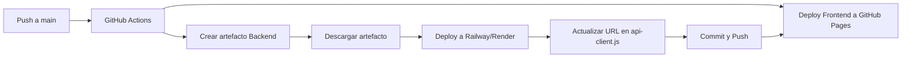

# 🚀 Guía de Despliegue en GitHub Pages

Esta guía te ayudará a desplegar tanto el frontend como el backend de tu aplicación.

## 📋 Requisitos Previos

1. **Repositorio en GitHub** - Tu código debe estar en un repositorio de GitHub
2. **GitHub Actions habilitado** - Asegúrate de que GitHub Actions esté habilitado en tu repositorio
3. **Cuenta en servicio de hosting** - Para el backend (Railway, Render, Heroku, etc.)

## 🔧 Configuración del Workflow

El workflow `deploy.yml` incluye dos jobs:

### 1. **deploy-frontend**: Despliega el frontend en GitHub Pages
- Se ejecuta automáticamente al hacer push a la rama `main`
- Puedes ejecutarlo manualmente desde la pestaña "Actions"

### 2. **deploy-backend**: Prepara el backend para despliegue
- Crea un artefacto con el código del backend
- Este artefacto debe ser descargado y desplegado en un servicio externo

## 📦 Pasos para el Despliegue

### Paso 1: Configurar GitHub Pages

1. Ve a **Settings** > **Pages** en tu repositorio
2. En **Build and deployment**:
   - Source: selecciona **GitHub Actions**
3. GitHub habilitará automáticamente las GitHub Pages

### Paso 2: Desplegar Frontend

El frontend se desplegará automáticamente cuando hagas push a `main`:

```bash
git add .
git commit -m "Deploy to production"
git push origin main
```

O puedes ejecutar el workflow manualmente:
1. Ve a la pestaña **Actions**
2. Selecciona **Deploy to GitHub Pages**
3. Haz clic en **Run workflow**

### Paso 3: Desplegar Backend

#### Opción A: Railway (Recomendado)

1. **Preparar el backend:**
   - Ejecuta el workflow `deploy.yml`
   - Descarga el artefacto `backend-deploy`
   - Extrae el archivo `backend.tar.gz`

2. **Crear app en Railway:**
   - Ve a [railway.app](https://railway.app)
   - Crea una nueva cuenta/proyecto
   - Selecciona **Deploy from GitHub repo** o **Deploy from CLI**

3. **Configurar variables de entorno en Railway:**
   ```
   NODE_ENV=production
   PORT=8080
   JWT_SECRET=tu_secreto_muy_seguro
   ```

4. **Obtener la URL del backend:**
   - Railway te proporcionará una URL como: `https://tu-app.railway.app`

5. **Actualizar el frontend:**
   - Edita `frontend/assets/js/api-client.js`
   - Cambia la URL por defecto:
   ```javascript
   return window.GITHUB_PAGES_API_URL || 'https://tu-app.railway.app';
   ```
   - Haz commit y push para actualizar GitHub Pages

#### Opción B: Render

1. **Crear cuenta en Render:**
   - Ve a [render.com](https://render.com)
   - Regístrate con GitHub

2. **Crear nuevo Web Service:**
   - Conecta tu repositorio de GitHub
   - Root Directory: `backend`
   - Build Command: `npm install`
   - Start Command: `node server.js`

3. **Configurar variables de entorno:**
   ```
   NODE_ENV=production
   JWT_SECRET=tu_secreto_muy_seguro
   ```

4. **Obtener la URL y actualizar el frontend** (igual que Railway)

#### Opción C: Heroku

1. **Instalar Heroku CLI:**
   ```bash
   npm install -g heroku
   heroku login
   ```

2. **Crear y desplegar:**
   ```bash
   cd backend
   heroku create tu-app-name
   git push heroku main
   ```

3. **Configurar variables:**
   ```bash
   heroku config:set NODE_ENV=production
   heroku config:set JWT_SECRET=tu_secreto_muy_seguro
   ```

## ⚙️ Variables de Entorno Requeridas

Asegúrate de configurar estas variables en tu servicio de hosting:

| Variable | Descripción | Ejemplo |
|----------|-------------|---------|
| `NODE_ENV` | Entorno de ejecución | `production` |
| `PORT` | Puerto del servidor | `8080` (o el que use tu provider) |
| `JWT_SECRET` | Secreto para tokens JWT | `mi_secreto_muy_seguro_123` |

## 🔗 Conectar Frontend con Backend

Después de desplegar el backend:

1. Copia la URL de tu backend (ej: `https://mi-api.railway.app`)
2. Edita `frontend/assets/js/api-client.js`:
   ```javascript
   return window.GITHUB_PAGES_API_URL || 'https://mi-api.railway.app';
   ```
3. También puedes usar una variable global en tu HTML:
   ```html
   <script>
     window.GITHUB_PAGES_API_URL = 'https://mi-api.railway.app';
   </script>
   ```
4. Haz commit y push para actualizar GitHub Pages

## ✅ Verificar el Despliegue

### Frontend (GitHub Pages)
1. Ve a `https://tu-usuario.github.io/tu-repo/`
2. Deberías ver la aplicación cargando

### Backend (Servicio Externo)
1. Abre la consola del navegador (F12)
2. Ve a la pestaña Network
3. Intenta iniciar sesión o registrar un usuario
4. Verifica que las peticiones a `/api/auth/*` respondan correctamente

## 🐛 Solución de Problemas

### Error CORS
Si ves errores de CORS en la consola:
- Asegúrate de que el backend tenga CORS habilitado
- El archivo `backend/server.js` ya incluye configuración CORS

### API no responde
- Verifica que el backend esté corriendo en tu servicio de hosting
- Revisa los logs del servicio (Railway/Render/Heroku)
- Confirma que la URL en `api-client.js` sea correcta

### GitHub Pages muestra error 404
- Espera unos minutos después del deploy
- Verifica que el workflow se completó exitosamente
- Revisa Settings > Pages para confirmar la configuración

## 📝 Notas Importantes

1. **GitHub Pages es solo para estáticos**: No puede ejecutar Node.js, por eso el backend debe estar en otro servicio
2. **HTTPS obligatorio**: GitHub Pages usa HTTPS, asegúrate de que tu backend también lo use
3. **Actualizaciones**: Cada vez que cambies la URL del backend, debes hacer commit y push para actualizar GitHub Pages

## 🎯 Flujo de Trabajo Recomendado



## 📚 Recursos Adicionales

- [Documentación de GitHub Pages](https://docs.github.com/es/pages)
- [GitHub Actions Documentation](https://docs.github.com/es/actions)
- [Railway Documentation](https://docs.railway.app/)
- [Render Documentation](https://render.com/docs)
